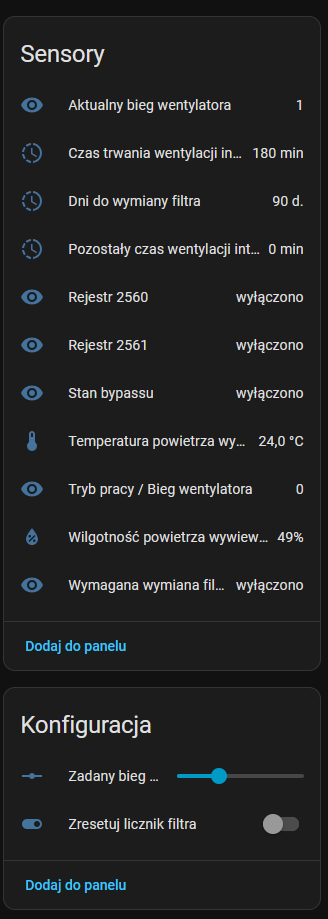

# MyStiebel Integration for Home Assistant

[](https://hacs.xyz)

> ## 🔀 About this fork
>
> This is a fork of [sanderkwantes/mystiebel](https://github.com/sanderkwantes/mystiebel), extended with support for the **Stiebel Eltron VRC 450** ventilation controller (registers 2553–2565), which isn't covered by the upstream integration.
>
> **What's new here:**
> - VRC450 registers are exposed as their own entities, grouped under a separate **"VRC 450 Ventilation"** child device (nested under your main device).
> - New entities added:
>
>   | Register | Entity | Entity type |
>   |---|---|---|
>   | 2553 | Exhaust Air Humidity | sensor |
>   | 2554 | Exhaust Air Temperature | sensor |
>   | 2555 | Bypass Status | binary sensor |
>   | 2556 | Reset Filter Counter | button *(disabled by default — one-shot action)* |
>   | 2557 | Intensive Ventilation Time Left | sensor |
>   | 2558 | Days To Filter Replacement | sensor |
>   | 2559 | Filter Replacement Needed | binary sensor |
>   | 2560, 2561, 2562 | *meaning not yet identified* | sensor / binary sensor |
>   | 2563 | Intensive Ventilation Duration | sensor |
>   | 2564 | Current Fan Speed | sensor |
>   | 2565 | Fan Speed Setpoint | number (slider, 0–3) |
>
>   
>
> - All VRC450 entities are **enabled by default**, except the filter-reset button, which stays disabled since pressing it resets the device's filter counters.
> - Registers 2560, 2561 and 2562 are exposed but their real meaning is still unconfirmed — if you can figure out what they represent on your unit, please open an issue or a PR upstream on this fork.
>
> **How to install this fork:** follow the [Installation](#installation) instructions below as-is, but when adding the custom repository in HACS, use this fork's URL instead of the upstream one:
>
> ```
> https://github.com/lukaszbany/mystiebel-vrc450premium
> ```
>
> **One important difference from upstream:** setup and configuration work exactly as described below, but this fork creates a **second Home Assistant device** — your main device stays the same, and a new **"VRC 450 Ventilation"** device appears alongside it (nested under it, linked via "Connected through"). All the VRC450 entities/controls from the table above live on *that* device page, not on the main one — so when the ["Enabling Entities"](#enabling-entities) steps say to open "the device page for your Stiebel Eltron device," open the **VRC 450 Ventilation** device specifically to find and manage these.

The `MyStiebel` integration allows you to connect and control your Stiebel Eltron heat pump boiler through the official MyStiebel cloud service. It provides a comprehensive set of entities to monitor and manage your device directly from Home Assistant.

This integration was built by reverse-engineering the API used by the official MyStiebel mobile app and is not officially affiliated with Stiebel Eltron.

> **Note:** This integration has been tested with a WWK-I 200 Plus heat pump boiler. While it is designed to support other Stiebel Eltron devices, adding support for additional models may require extra development and testing. As I do not have access to other devices, contributions and feedback from users with different models are highly appreciated.

## Features

This integration provides a rich set of features to fully integrate your Stiebel Eltron device into Home Assistant:

* **Multi-Device Support:** The configuration flow allows you to add multiple Stiebel Eltron devices from a single MyStiebel account, each appearing as a separate device in Home Assistant.
* **Rich Device Information:** Automatically populates device information, including model, manufacturer, software version, and MAC address.
* **Full Control Suite:** Provides entities for complete control over your device's settings:
    * **Switches:** For toggling functions like the hygiene program, frost protection, and more.
    * **Numbers:** For setting precise values like target temperatures and percentages.
    * **Selects:** For choosing from a list of modes, such as the heating mode for Eco or Comfort settings.
* **Advanced Sensors:** In addition to standard sensors, the integration creates several combined and calculated sensors for a better user experience:
    * Human-readable error messages instead of cryptic codes.
    * Combined software version and Product ID (PID) sensors.
    * Formatted runtime sensors for compressor and heating element (e.g., "8 d, 20 h").
    * Calculated sensors for "Available Baths" and "Available Shower Time" based on user-configurable values.
* **Smart Entity Management:** To provide a clean user experience out-of-the-box, only a curated list of essential sensors and controls are enabled by default. All other "installer" or diagnostic entities are created but disabled, and can be enabled by the user via the entity registry.
* **Multilingual Support:** All entity names and configuration screens are fully translated and will automatically use the language configured in your Home Assistant instance (supports English, Dutch, German, Polish, Slovenian, Italian, French, Spanish, Czech, Hungarian, and Slovak based on the provided data).

## Prerequisites

* A Stiebel Eltron account registered with the MyStiebel service.
* Home Assistant Community Store (HACS) installed to easily manage this custom integration.

## Installation

The recommended way to install this integration is through the Home Assistant Community Store (HACS).

1.  **Add Custom Repository in HACS:**
    * Go to **HACS > Integrations** in your Home Assistant sidebar.
    * Click the three dots in the top right corner and select **"Custom repositories"**.
    * In the "Repository" field, paste the URL of your GitHub repository.
    * In the "Category" dropdown, select **"Integration"**.
    * Click **"ADD"**.

2.  **Install the Integration:**
    * The "MyStiebel" integration will now appear in your HACS integrations list.
    * Click on it and then click the **"DOWNLOAD"** button.
    * Follow the prompts to complete the download.

3.  **Restart Home Assistant:**
    * After installation, you **must restart Home Assistant** for the integration to be loaded. Go to **Settings > System** and click the **"RESTART"** button.

## Configuration

Configuration is done entirely through the Home Assistant UI.

1.  Navigate to **Settings > Devices & Services**.
2.  Click the **"+ ADD INTEGRATION"** button in the bottom right.
3.  Search for **"MyStiebel"** and click on it.
4.  **Step 1: Credentials:** You will be asked to enter your MyStiebel username and password.
5.  **Step 2: Device Selection:** The integration will connect to your account and discover your device(s). Select the specific device you want to add from the dropdown menu.
6.  Click **"SUBMIT"**.

The integration will be set up, and a new device with all its entities will be added to Home Assistant. You can repeat this process to add other devices from your account.

## Post-Installation Usage

### Enabling Entities

By default, only a small set of essential entities are enabled to keep your dashboard clean. To enable more "installer" or diagnostic entities:
1.  Navigate to the device page for your Stiebel Eltron device.
2.  Click on the link that says `XX entities`.
3.  You will see a list of all entities, with many marked as "disabled".
4.  Click on any disabled entity you want to use, and use the toggle in the top right of the dialog box to enable it.

### Configuration Options

You can configure the values for the calculated sensors (Available Baths and Shower Time).
1.  Navigate to **Settings > Devices & Services**.
2.  Find the MyStiebel integration and click the **"CONFIGURE"** button.
3.  Set your average volume for a bath and output for a shower. The integration will automatically reload with the new values.

### Time Schedules

The integration creates 42 `time` entities to control the heating schedules.

## Contributions

Contributions are welcome! If you find a bug or have a feature request, please open an issue on the GitHub repository.

## Disclaimer

This is a third-party integration and is not officially supported by Stiebel Eltron. Use at your own risk.